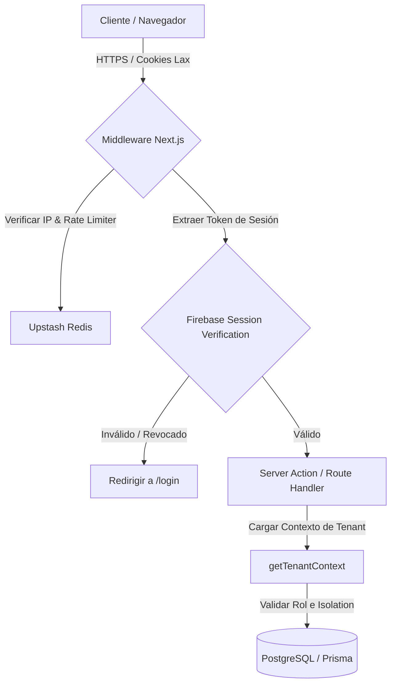

# Arquitectura de Seguridad - ERP Panamá
Este documento describe el diseño estructural y de seguridad del ERP Panamá.

---

## 1. Diagrama de Flujo de Solicitudes (Request Flow)

---

## 2. Componentes Clave de Hardening
1. **Middleware Global:** intercepta todas las rutas excepto login, archivos públicos y assets. Valida el rate limiting IP por Upstash Redis y la existencia de las cookies.
2. **Contexto Aislado (getTenantContext):** Cacheado por petición. Proporciona de forma segura el inquilino (`empresaId`), usuario e IP verificada.
3. **Adaptadores de Integración Gated:** Toda conexión a pasarelas (PayPal, Yappy, PAC) o storage (S3, Vercel Blob) funciona mediante interfaces tipadas que fallan de forma segura si no existen credenciales activas.
